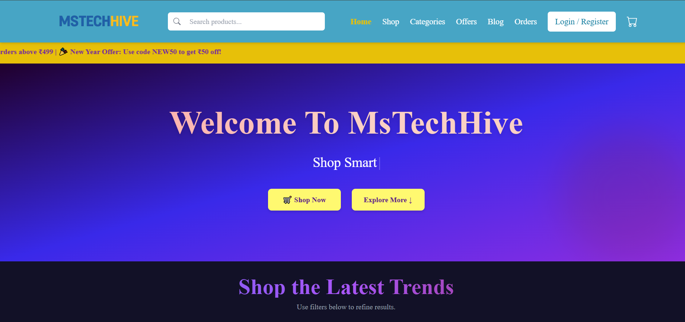
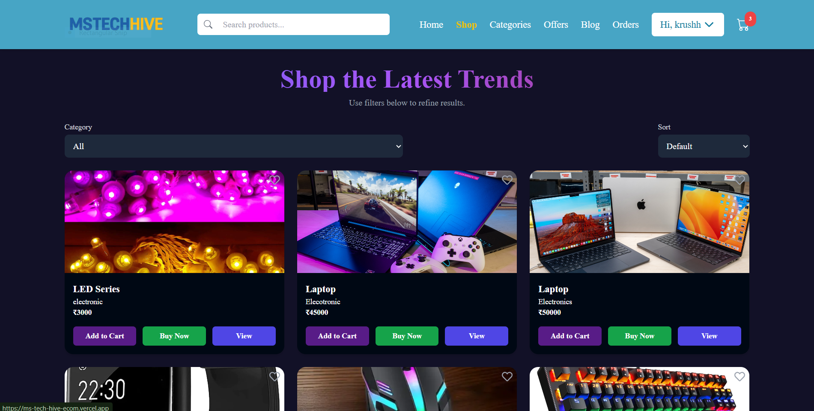
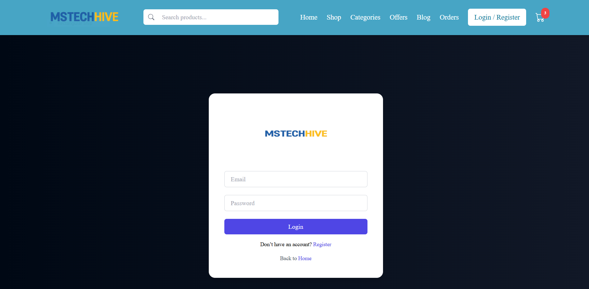
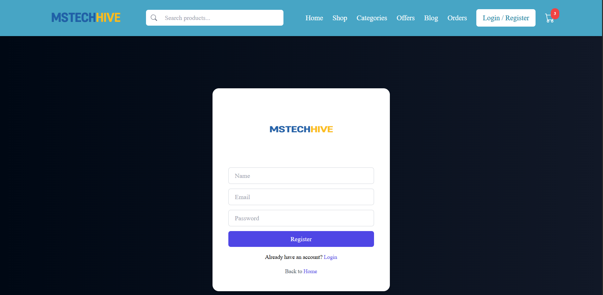
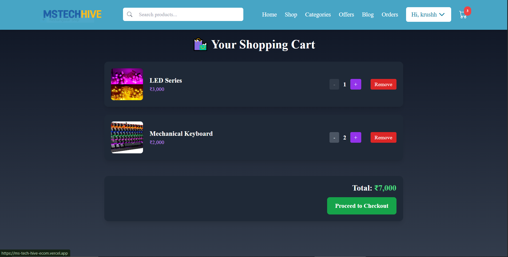
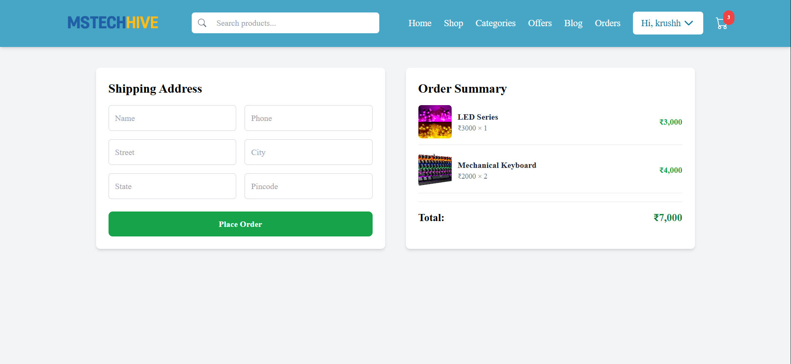
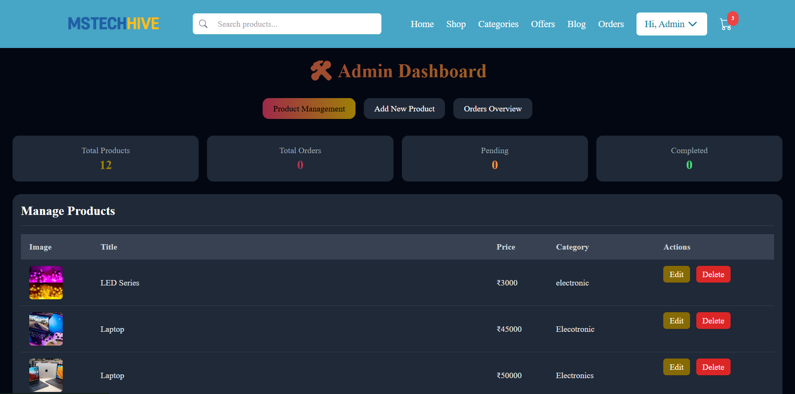
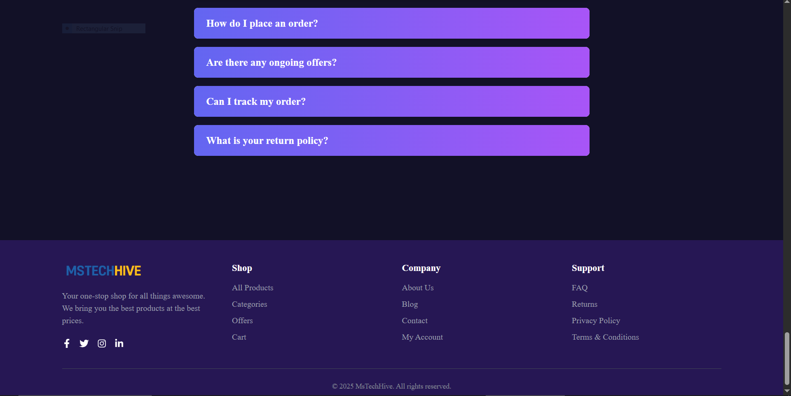

# 🛍️ MSTECHHIVE

**MSTECHHIVE** is a full-featured e-commerce platform built using the **MERN Stack (MongoDB, Express, React, Node.js)**.  
This platform allows users to browse and purchase products, manage their shopping cart, and update their profile.  
It also includes an **Admin Dashboard** for managing products and viewing orders with role-based authentication.

---

## 🚀 Features

### 🧑‍💻 User Side
- User registration and login (authentication)
- Browse and search products
- Filter products by category or keyword
- Add and remove products from the cart
- Edit and update user profile
- Secure checkout flow

### 👩‍🏫 Admin Side
- Admin authentication and authorization
- Add, edit, delete, and manage products
- View and manage user orders
- Dashboard overview for products and orders

---

## 🧩 Tech Stack

| Technology | Description |
|-------------|-------------|
| **MongoDB** | NoSQL database for storing users, products, and orders |
| **Express.js** | Backend framework for building RESTful APIs |
| **React.js** | Frontend library for building a responsive user interface |
| **Node.js** | Server-side runtime environment |
| **Tailwind CSS** | (Optional) For responsive and modern UI styling |

---
## cd backend
node server.js

## cd frontend
npm start

---

## 🔌 API Endpoints (Sample)

### User Routes
- `POST /api/auth/register` → Register user  
- `POST /api/auth/login` → Login user  
- `GET /api/users/:id` → Get user profile  
- `PUT /api/users/:id` → Update user profile  

### Product Routes
- `GET /api/products` → Get all products  
- `POST /api/products` → Add new product (Admin only)  
- `PUT /api/products/:id` → Update product (Admin only)  
- `DELETE /api/products/:id` → Delete product (Admin only)  

### Cart Routes
- `POST /api/cart/add` → Add product to cart  
- `GET /api/cart` → Get user cart items  

---

## 🧠 Role-Based Access
- **User:** Can view, search, and purchase products.  
- **Admin:** Has full access to product and order management through the admin dashboard.

---

### 🏠 Home Page

### 🛒 Product Page

### 🔐 Login & Register

### 🛍 Cart Page

### 🧑‍💼 Admin Dashboard

### ⚙️ Footer Section

